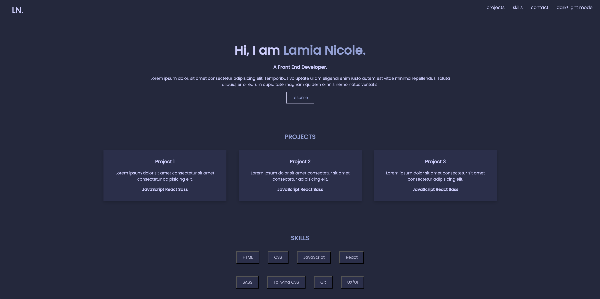
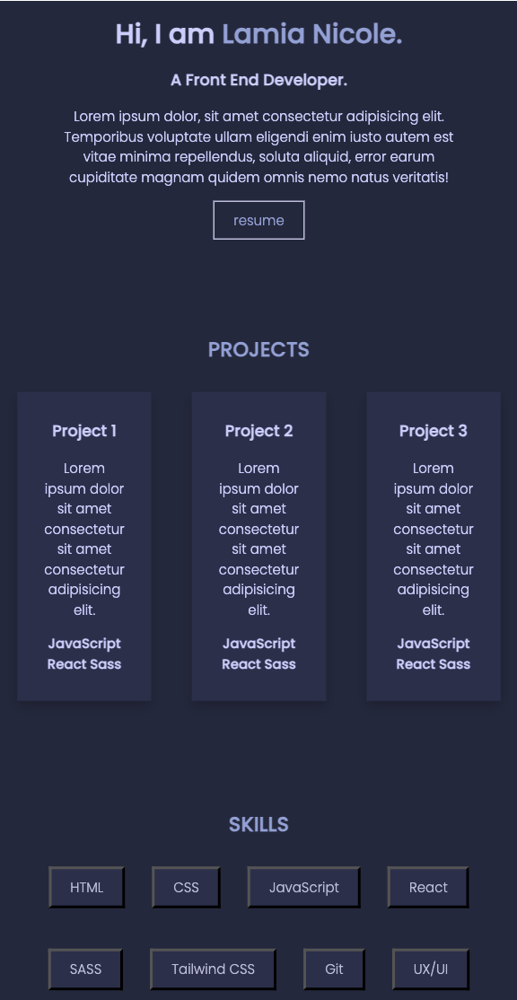

# Simplefolio Landing Page

A simple React project for a personal landing page.

## Description

This project is a beginner-level landing page built using React and TypeScript. It focuses on practicing the setup and structuring of React components, as well as planning the folder structure of a landing page. The project features basic CSS styling and uses Media Queries for responsive design, ensuring it looks great on both large screens and mobile devices. It is designed to help improve foundational frontend development skills.

## Features

- Displays personal information and a short description
- Responsive design using Media Queries for various screen sizes
- A styled button placeholder for potential interactivity
- Dark Mode functionality is not yet implemented, but the framework is prepared for future development

## Preview

### Desktop View

### Mobile View

